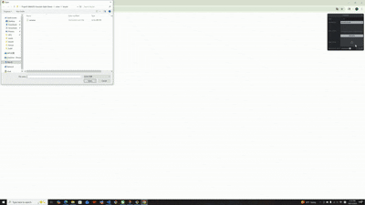

# Project5-WebGPU-Gaussian-Splat-Viewer

**University of Pennsylvania, CIS 565: GPU Programming and Architecture, Project 5**

* Ruichi Zhang
* Tested on: **Google Chrome 141.0.7390.123** on
  Windows 10, AMD Ryzen 9 7950X3D @ 4201 Mhz, 16 Core(s), NVIDIA GeForce RTX 4080 SUPER

### Live Demo

### Demo Video/GIF

<!-- <video width="640" height="360" controls>
  <source src="images/gaussian_splatting.mp4" type="video/mp4">
  Your browser does not support the video tag.
</video> -->

## Overview

This project implements a GPU-based Gaussian Splatting renderer and compares it against a baseline point cloud renderer.

## Performance Analysis
### Comparison between Point-Cloud and Gaussian Renderer
The point-cloud renderer displays individual points directly, which results in a sparse and discrete appearance, especially when the point density is low. In contrast, the Gaussian renderer blends each point as a smooth 3D Gaussian splat, creating continuous surfaces and more realistic shading. While the Gaussian method achieves much higher visual fidelity and better approximates object geometry, it also introduces additional computation for blending and opacity accumulation. Consequently, the Gaussian renderer is more computationally expensive but produces a significantly smoother and more photorealistic image compared to the point-cloud renderer

### Effect of Workgroup Size on Performance
Changing the workgroup size in the Gaussian renderer affects how many threads are launched per compute group and how efficiently GPU resources are utilized. Increasing the workgroup size typically improves performance up to an optimal point (such as 128 or 256 threads per group), as it increases occupancy and reduces scheduling overhead. However, beyond that point, performance may degrade slightly due to register pressure, shared memory limitations, or reduced warp scheduling flexibility. Thus, performance scales non-linearly with workgroup size, and finding the optimal configuration depends on the specific GPU architecture.

### Effect of View-Frustum Culling on Performance
Enabling view-frustum culling improves performance because it prevents the renderer from processing Gaussians that are outside the camera’s visible region. By discarding off-screen splats early, the GPU can focus computation on only the visible subset, reducing both memory bandwidth usage and blending operations. The performance gain is especially noticeable in large scenes where many Gaussians lie outside the camera’s view. The cost of performing the culling check is small compared to the rendering time saved, making this an effective optimization.

### Effect of Number of Gaussians on Performance
The number of Gaussians directly impacts rendering performance since each Gaussian requires projection, blending, and shading computations. As the number of Gaussians increases, the total workload scales approximately linearly, leading to longer frame times and higher GPU memory usage. For smaller datasets, the GPU can handle the workload efficiently due to high parallelism, but at very large counts, bandwidth and arithmetic throughput become bottlenecks. Therefore, performance decreases with increasing Gaussian count, reflecting the trade-off between scene detail and real-time rendering speed.

### Credits

- [Vite](https://vitejs.dev/)
- [tweakpane](https://tweakpane.github.io/docs//v3/monitor-bindings/)
- [stats.js](https://github.com/mrdoob/stats.js)
- [wgpu-matrix](https://github.com/greggman/wgpu-matrix)
- Special Thanks to: Shrek Shao (Google WebGPU team) & [Differential Guassian Renderer](https://github.com/graphdeco-inria/diff-gaussian-rasterization)
